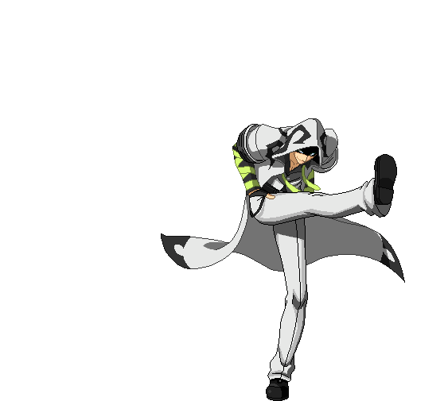
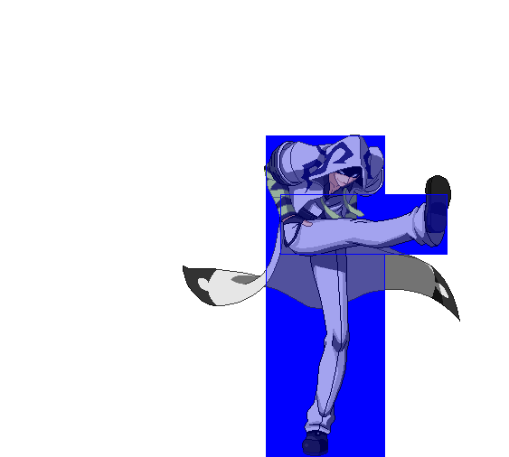

# Sprite Management Tools

A collection of scripts to do various sprite manipulation.

The goal is:
- [x] (done) Recolor a sprite using a custom palette
- [ ] (75% done) Create a centered gif given a series of sprites and collision information
- [ ] (25% done) Discover moves and find the sprites associated with them, and their timing
- [ ] (0% done) Put all of the above into a neat little pipeline

## Indexed PNG Palette Swapper

```
usage: spriterecolor.py [-h] (--file FILE | --directory DIRECTORY) [--overwrite] --reference REFERENCE output

Given an indexed .png file or a directory of indexed .png files, recolors them using another provided indexed .png file's palette.

positional arguments:
  output                Directory to put output files.

optional arguments:
  -h, --help            show this help message and exit
  --file FILE           File to recolor.
  --directory DIRECTORY Directory of files to recolor.
  --overwrite           Overwrite existing files in output directory.
  --reference REFERENCE Reference file to take palette from.
```

Small python script that lets you transfer one indexed png's palette to another indexed png (or a directory of them.) Either set `--file` or `--directory`, not both.

Requires the `pillow` python package.

Tries to keep transparency where possible. I highly recommend ensuring that all transparent colors have completely unique rgb values from other colors, as doing otherwise can cause strange behavior when you try to use the image in general.

<p align="center">
   <br>
  <i>wow look it's transparent</i>
</p>

## GIFifier

Given a series of pngs and collision information, generates animated gifs. Can choose whether to draw hitboxes/hurtboxes.

Not currently customizable from the command line, but if you're really itching to use it take a look at the bottom of `gifify.py` for how to generate the gifs themselves, and `spritemgmt.py` (which will later on be the main tool) to see how to make the output gif use your desired palette.

<p align="center">
  <br>
  <i>neat.jpeg</i>
</p>