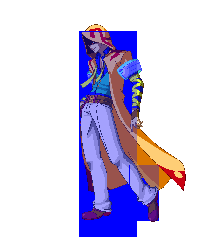

# Sprite Management Tools

A collection of scripts to do various sprite manipulation.

The goal is:
- [x] (done) Recolor a sprite using a custom palette
- [ ] (75% done) Create a centered gif given a series of sprites and collision information
- [ ] (25% done) Discover moves and find the sprites associated with them, and their timing
- [ ] (0% done) Put all of the above into a neat little pipeline

## Indexed PNG Palette Swapper

```
usage: spriterecolor.py [-h] (--file FILE | --directory DIRECTORY) [--overwrite] --reference REFERENCE output

Given an indexed .png file or a directory of indexed .png files, recolors them using another provided indexed .png file's palette.

positional arguments:
  output                Directory to put output files.

optional arguments:
  -h, --help            show this help message and exit
  --file FILE           File to recolor.
  --directory DIRECTORY Directory of files to recolor.
  --overwrite           Overwrite existing files in output directory.
  --reference REFERENCE Reference file to take palette from.
```

Small python script that lets you transfer one indexed png's palette to another indexed png (or a directory of them.) Either set `--file` or `--directory`, not both.

Requires the `pillow` python package.

Tries to keep transparency where possible. I highly recommend ensuring that all transparent colors have completely unique rgb values from other colors, as doing otherwise can cause strange behavior when you try to use the image in general.

<p align="center">
   <br>
  <i>wow look it's transparent</i>
</p>

## GIFifier

Given a series of pngs and collision information, generates animated gifs. Can choose whether to draw hitboxes/hurtboxes.
```
usage: gifify.py [-h] [--pngdir PNGDIR] [--jsondir JSONDIR] [--duration DURATION] [--hb HB] [--overwrite] output

Generates a gif from a folder of PNG sprite files and a folder of JSON collision files.

positional arguments:
  output               Path to save generated .gif to.

options:
  -h, --help           show this help message and exit
  --pngdir PNGDIR      Path to directory containing PNG sprite files.
  --jsondir JSONDIR    Path to directory containing JSON collision files.
  --duration DURATION  The duration of each frame.
  --hb                 Whether to render hitboxes.
  --overwrite          If file already exists at output location, overwrite it.
  ```

Still requires the `Pillow` package.

Given a directory of sprites and a directory of corresponding collision JSON data, generates a gif using all of the sprites in the folder in the order they are found. Use `--duration` to define how long each sprite is shown on screen.

Better control over creating the gif is available if you reference it from another script or using the eventually-to-be-made `spritemgmt.py` script/ui. I may add the option to set gif frame order with an input file.

<p align="center">
  <br>
  <i>neat.jpeg</i>
</p>